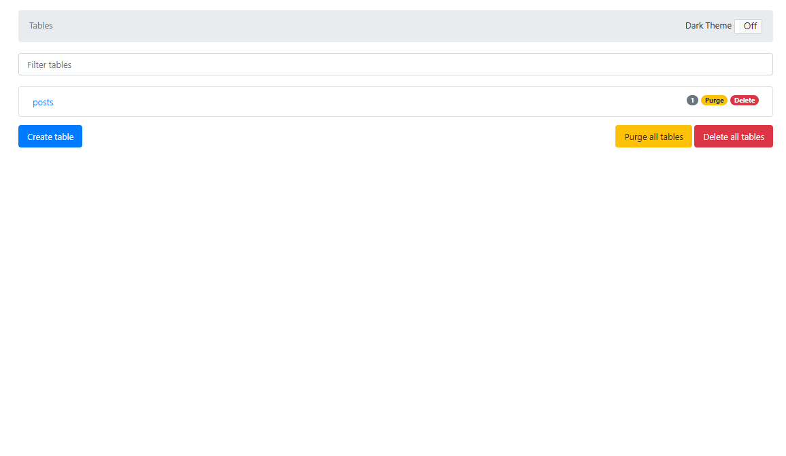

🌙 lambda-websocket-template
====


## 📗 プロジェクトの概要

AWS（API Gateway → Lambda → DynamoDB）を利用したWebSocketのサンプルです。
リアルタイムでチャットするようなアプリケーションの構築が出来ます。
SAM を利用して管理しているので、コマンドひとつでインフラを構築出来るようにしています。
また、Dockerを利用することでローカル環境でも実装・テストが出来るようにしています。

## 🌐 Demo

wscat -c wss:///3gphoqfej8.execute-api.ap-northeast-1.amazonaws.com/Prod?roomId=test

## 📦 ディレクトリ構造

```
.
├── README.md
├── app (Lambdaのモジュール)
│   ├── app.js
│   ├── data
│   ├── dynamodb-client.js
│   ├── lambda.js
│   ├── local-app.js
│   ├── node_modules
│   ├── package-lock.json
│   ├── package.json
│   ├── schema
│   └── tests
├── dc.sh (Docker管理用のシェルスクリプト)
├── docker
│   ├── awscli
│   ├── docker-compose.yml
│   └── dynamodb
├── layers (共通モジュール)
│   └── app-layer
├── samconfig.toml
└── template.yaml
```

## 🔧 開発環境の構築

IAM ユーザーを用意する
```
ユーザ名：「lambda-user」
アクセス権限：
「AdministratorAccess」
```

SAM CLI をインストールする
```
$ pip install aws-sam-cli
```

wscat をインストール
```
npm install -g wscat
```

AWSにアクセスする為の設定を作成する
```
$ aws configure --profile lambda-user 
AWS Access Key ID [None]: xxxxxxxxxx
AWS Secret Access Key [None]: xxxxxxxxxx
Default region name [None]: ap-northeast-1
Default output format [None]: json
```

## 🖊️ Docker 操作用シェルスクリプトの使い方

```
Usage:
  dc.sh [command] [<options>]

Options:
  stats|st                 Dockerコンテナの状態を表示します。
  init                     Dockerコンテナ・イメージ・生成ファイルの状態を初期化します。
  start                    すべてのDaemonを起動します。
  stop                     すべてのDaemonを停止します。
  --version, -v     バージョンを表示します。
  --help, -h        ヘルプを表示します。
```

## 💬 使い方

ローカルでAPIを起動する
```
# 事前準備
$ ./dc.sh init
$ docker network create lambda-local

# Dockerを起動する
$ ./dc.sh start

# DynamoDBにテーブルを作成する
$ ./dc.sh aws local
> aws dynamodb create-table --cli-input-json file://app/schema/connections.json --endpoint-url http://dynamodb:8000  --billing-mode PAY_PER_REQUEST
> aws dynamodb create-table --cli-input-json file://app/schema/room.json --endpoint-url http://dynamodb:8000  --billing-mode PAY_PER_REQUEST
> aws dynamodb list-tables  --endpoint-url http://dynamodb:8000 
> aws dynamodb scan --table-name simple_websocket_app_posts  --endpoint-url http://dynamodb:8000
(テーブルを削除する場合)
> aws dynamodb delete-table --table-name simple_websocket_app_posts --endpoint-url http://dynamodb:8000

# SAMでアプリをビルドしてからAPIを起動する
$ sam build
$ sam local start-api --docker-network lambda-local

# ローカルだと動作しないので調査中。。

```

本番環境（AWS） にデプロイする
```
# ビルドを実行する（.aws-samディレクトリに生成される）
$ sam build
# AWSに反映する
$ sam deploy --config-env stg

# （ターミナル２つから）ルームに接続してメッセージを送信する
$ wscat -c wss:///xxxxxx.execute-api.ap-northeast-1.amazonaws.com/Prod?roomId=test
Connected (press CTRL+C to quit)
< { "action": "sendmessage", "data": {"type": "test", "value": "hello world" }}
```

AWSから、DynamoDB、Lambda&APIGatewayを削除する
```
$ sam delete --stack-name simple-websocket-app --profile lambda-user
```

### DynamoDBAdmin
DynamoDBに接続してデータの参照や編集が可能です。
Dockerを起動後に以下のURLにアクセスすると利用可能です。

http://localhost:8001/




## 🎨 参考

| プロジェクト| 概要|
| :---------------------------------------| :-------------------------------|
| [WebSocket - AWS の API Gateway と Lambda でルーム機能付きのchatを作る時の仕様を考える](https://qiita.com/anfangd/items/ebcd77173341b10b3684)| WebSocket - AWS の API Gateway と Lambda でルーム機能付きのchatを作る時の仕様を考える |

## 🎫 Licence

[MIT](https://github.com/isystk/lambda-websocket-template/blob/master/LICENSE)

## 👀 Author

[isystk](https://github.com/isystk)
